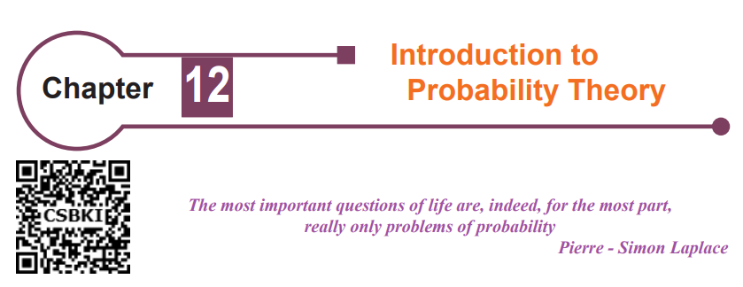
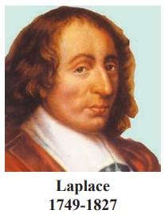

<!-- # Content Will be Added Soon -->

## Introduction

A gambler’s dispute in 1654 led to the creation of a mathematical
theory of probability by two famous French mathematicians, Blaise
Pascal and Pierre de Fermat. The fundamental principles of probability
theory were formulated by Pascal and Fermat for the first time. After an
extensive research, Laplace published his monumental work in 1812,
and laid the foundation to Probability theory. In statistics, the Bayesian
interpretation of probability was developed mainly by Laplace.

The topic of probability is seen in many facets of the modern world.
From its origin as a method of studying games, probability has involved
in a powerful and widely applicable branch of mathematics. The uses of
probability range from the determination of life insurance premium, to the
prediction of election outcomes, the description of the behaviour of molecules in a gas. Its utility is
one good reason why the study of probability has found in the way into a school textbook.
The interpretation of the word ‘probability’ involves synonyms such as chance, possible, probably,
likely, odds, uncertainty, prevalence, risk, expectancy etc.

Our entire world is filled with uncertainty. We make decisions affected by uncertainty virtually
every day. In order to measure uncertainty, we turn to a branch of mathematics called theory of
probability. Probability is a measure of the likeliness that an event will occur. 

___
Learning Objectives  
On completion of this chapter, the students are expected to
- understand the classical theory of probability and axiomatic approach to probability.
- understand mutually exclusive, mutually inclusive and exhaustive events.
- understand the concepts of conditional probability and independent events.
- apply Bayes’ theorem.
- apply probability theory in day-to-day life.
___

