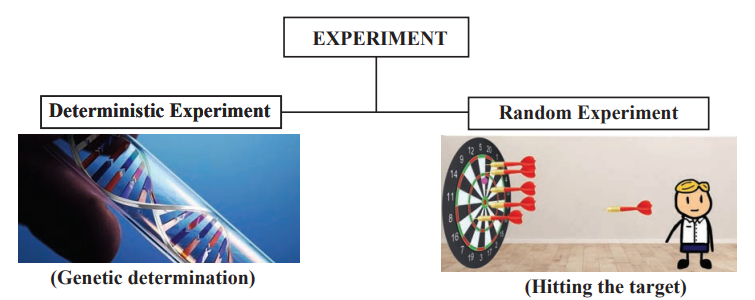
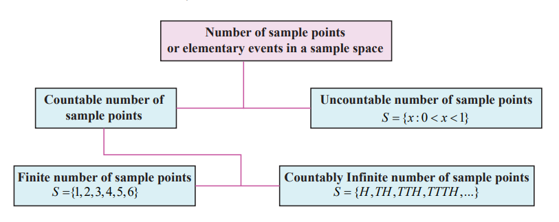

<!-- # Content Will be Added Soon -->
## Basic definitions
Before we study the theory of probability, let us recollect the definition of certain terms already
studied in earlier classes, which are frequently used.

___
**Definition 12.1**  
An experiment is defined as a process for which its result is well defined.
___

___
 **Definition 12.2**  
Deterministic experiment is an experiment whose outcomes can be predicted with certain,under ideal conditions.
___

___
**Definition 12.3**  
A random experiment (or non-deterministic) is an experiment
(i) whose all possible outcomes are known in advance,
(ii) whose each outcome is not possible to predict in advance, and
(iii) can be repeated under identical conditions.
___

A die is ‘rolled’, a fair coin is ‘tossed’ are examples for random experiments.

___
**Definition 12.4**  
A simple event (or elementary event or sample point) is the most basic possible outcome ofa random experiment and it cannot be decomposed further.
___

___
**Definition 12.5**  
A sample space is the set of all possible outcomes of a random experiment. Each point in sample space is an elementary event.
___

**Illustration 12.1**  
1. (i) If a die is rolled, then the sample space *S* = {1, 2, 3, 4, 5, 6}.  
    (ii) A coin is tossed, then the sample space *S* = {*H,T*}.

1. (i) Suppose we toss a coin until a head is obtained. One cannot say in advance how manytosses will be required, and so the sample space. 
    *S* = {*H, TH, TTH, TTTH,...*} is an infinite set. 
    (ii) The sample space associated with the number of passengers waiting to buy train tickets in counters is *S* = {0,1,2,...}.

1. (i) If the experiment consists of choosing a number randomly between 0 and 1, then the sample space is *S* = { x: 0< x <1}.  
    (ii) The sample space for the life length (t in hours) of a tube light is *S* = { t: 0 < t<1000}.

From (2) and (3), one need to distinguish between two types of infinite sets, where one type is significantly ‘larger’ than the other. In particular, *S* in (2) is called **countably infinite**, while the *S* in (3) is called **uncountably infinite**. The fact that one can list the elements of a countably infinite set means that the set can be put in one-to-one correspondence with natural numbers N . On the other hand, you cannot list the elements in uncountable set.  
    From the above example, one can understand that the sample space may consist of countable or uncountable number of elementary events.

