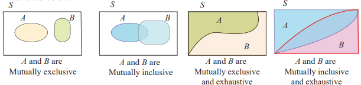
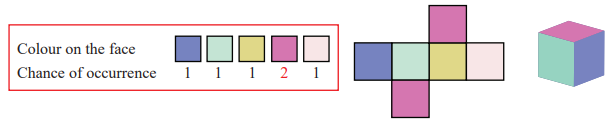

<!-- # Content Will be Added Soon -->
## Finite sample space

In this section we restrict our sample spaces that have at most a finite number of points.

**Types of events**  
Let us now define some of the important types of events, which are used frequently in this
chapter.

- Sure event or certain event 
- Impossible event
- Complementary event 
- Mutually exclusive events
- Mutually inclusive event 
- Exhaustive events
- Equally likely events 
- Independent events (defined after learning the concepts of probability)

**Definition 12.6**  
When the sample space is finite, any subset of the sample space is an  **event**. That is, all elements of the power set P(S)  of the sample space are defined as events. An event is a collection of sample points or elementary **events**. The sample space *S* is called **sure event or certain event**. The null set ∅ in *S* is called an **impossible event**.

**Definition 12.7**  
For every event A, there corresponds another event  \bar{A} is called the **complementary event** to A. It is also called the event ‘not A’.

**Illustration 12.2**  
Suppose a sample space *S* is given by *S* = {1,2,3,4}.  
Let the set of all possible subsets of *S* (the power set of *S*) be P(S).  
P(S) = {∅, {1}, {2}, {3}, {4}, {1, 2}, {1, 3}, {1, 4}, {2, 3}, {2, 4}, {3, 4},
 {1, 2, 3}, {1, 2, 4}, {1, 3, 4}, {2, 3, 4}, {1, 2, 3, 4}}

(i) All the elements of  P(S) are events.  
(ii) ∅ is an impossible event.  
(iii) {1},{2},{3},{4} are the simple events or elementary events.  
(iv) {1, 2, 3, 4} is a sure event or certain event.

**Definition 12.8**  
Two events cannot occur simultaneously are mutually exclusive events. *A*1, *A*2, *A*3,...., *A*k are **mutually exclusive** means that, *Ai ∩ Aj =∅ , for i ≠ j*.

**Definition 12.9**  
Two events are mutually inclusive when they can both occur simultaneously. *A*1, *A*2, *A*3,...., *A*k are mutually inclusive means that, *Ai ∩ Aj ≠∅ , for i ≠ j*

**Illustration 12.3**  
When we roll a die, the sample space S = {1,2,3,4,5,6}.  
(i) Since{1, 3}  ∩ {2, 4, 5, 6}  = ∅, the events {1,3}and{2, 4,5,6}are mutually exclusive events.  
(ii) The events {1,6,},{2,3,5} are mutually exclusive.  
(iii) The events {2,3,5},{5,6} are mutually inclusive, since {2, 3, 5} ∩ {5, 6}= {5} ≠∅  

**Definition 12.10**  
*A*1, *A*2, *A*3,...., *A*k are called **exhaustive events** if, *A*1∪*A*2∪*A*3∪....∪*A*k = *S*

**Definition 12.11**  
*A*1, *A*2, *A*3,...., *A*k are called **mutually exclusive and exhaustive events** if,  
(i)*A*i ∩ *A*j  = ∅, for i ≠ j  (ii) *A*1∪*A*2∪*A*3∪....∪*A*k = *S*

**Illustration 12.4**  
When a die is rolled, sample space *S* = {1,2,3,4,5,6}.  
Some of the events are {2,3},{1,3,5},{4,6},{6} and{1,5}. 
(i) Since {2, 3} ∪ {1, 3, 5} ∪ {4, 6} = {1, 2, 3, 4, 5, 6} = S (sample space), the events
{2,3},{1,3,5},{4,6} are exhaustive events. 
(ii) Similarly {2,3},{4,6}and{1,5} are also exhaustive events. 
(iii) {1,3,5},{4,6},{6} and{1,5} are not exhaustive events. 
 (Since {1, 3, 5} ∪ {4, 6} ∪ {6} ∪ {1, 5} ≠ S )
(iv) {2,3},{4,6},and{1,5} are mutually exclusive and exhaustive events, since
 {2, 3} ∩ {4, 6} = ∅ {2, 3} ∩ {1, 5} = ∅ {4, 6} ∩ {1, 5} = ∅ and {2, 3} ∪ {4, 6} ∪ {1, 5} = *S*

**Types of events associated with sample space are easy to visualize in terms of Venn diagrams, as illustrated below**  

**Definition 12.12**  
The events having the same chance of occurrences are called **equally likely events**.

Example for equally likely events: Suppose a fair die is rolled.   

Example for not equally likely events: A colour die is shown in figure is rolled. 

Similarly, suppose if we toss a coin, the events of getting a head or a tail are equally likely.

**Methods to find sample space**

**Illustration 12.5**  
Two coins are tossed, the sample space is  
(i) *S* = {*H*, *T*} × {*H*, *T*} = {(*H*, *H*),(*H*, *T*),(*T*, *H*),(*T*, *T*)} or {*HH*, *HT*, *TH*, *TT*}    
(ii) If a coin is tossed and a die is rolled simultaneously, then the sample space is *S* = {*H*, *T*} × {1, 2, 3, 4, 5, 6} = { *H*1, *H*2, *H*3, *H*4, *H*5, *H*6, *T*1, *T*2, *T*3, *T*4, *T*5, *T*6} or *S* = {(*H*, 1),(*H*,2),(*H*,3),(*H*,4),(*H*,5),(*H*,6),(*T*,1),(*T*,2),(*T*,3),(*T*,4),(*T*,5),(*T*,6)}.    
Also one can interchange the order of outcomes of coin and die. The following table gives the 
sample spaces for some random experiments.  
| Random Experiment | Total Number of Outcomes | Sample space |
|  --- |  --- | --- |
|  Tossing a fair coin  | 21 = 2 | {*H*, *T*} |
|  Tossing two coins |  22 = 4 | {*HH*, *HT*, *TH*, *TT*} |
|  Tossing three coins |  23 = 8 | {*HHH*, *HHT*, *HTH*, *THH*, *HTT*, *THT*, *TTH*, *TTT*} |
|  Rolling fair die |  61 = 6 | {1, 2, 3, 4, 5, 6} |
|  Rolling Two dice or single die two times. |  62 = 36 | {(1,1) ,(1,2), (1,3), (1,4), (1,5), (1,6), (2,1), (2,2), (2,3), (2,4), (2,5), (2,6), (3,1), (3,2), (3,3), (3,4), (3,5), (3,6), (4,1), (4,2), (4,3), (4,4), (4,5), (4,6), (5,1), (5,2), (5,3), (5,4), (5,5), (5,6), (6,1), (6,2),(6,3), (6,4), (6,5), (6,6)} |
|  Drawing a card from a pack of 52 playing cards |  521 = 52 | Heart ♥ A 2 3 4 5 6 7 8 9 10 J Q K Red in colour Diamond ♦ A 2 3 4 5 6 7 8 9 10 J Q K Red in colour Spade ♠ A 2 3 4 5 6 7 8 9 10 J Q K Black in colour Club ♣ A 2 3 4 5 6 7 8 9 10 J Q K Black in colour |

**Notations**  
Let A and B be two events.  
(i) A ∪ B stands for the occurrence of A or B or both.  
(ii) A ∩ B stands for the simultaneous occurrence of A and B. A ∩ B can also be written as AB.  
(iii) \bar{A} or {A}' or {A}^c stands for non-occurrence of *A*  
(iv) ( ) A ∩ B stands for the occurrence of only A.
