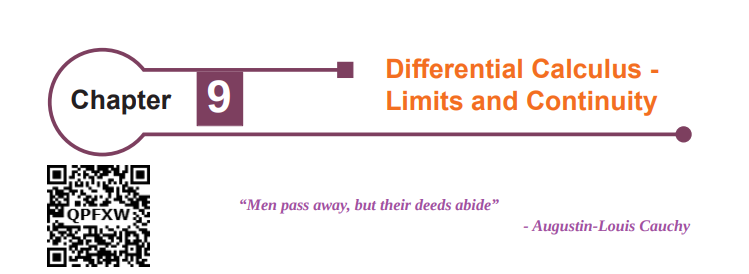
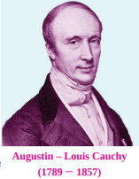
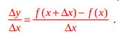
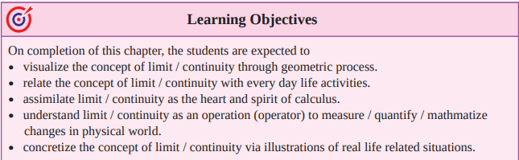



# 9.1 Introduction
**Calculus** is about rates of change. Rates of change occur in all the sciences. **A mathematician**
is interested in measuring the rate of change of the deviations of a straight line at a point on a curve,
while a **physicist** is interested in the rate of change of displacement, and the velocity of a moving
object. A **chemist** wants to know the rate of a chemical reaction that would result in the formation of
one or more substances (called products) from one or more starting materials (called reactants).

A **biologist** would like to analyse the changes that take 
place in the number of individuals in an animal population or
plant population at any time; he would also want to know the
rate at which blood flows through a blood vessel, such as a
vein or artery and the part of the vessel / artery in which this
flow is lowest or highest.

An **economists** also studies marginal demand, marginal
revenue, and marginal profit, which are drawn from rates
of change (that is, derivatives) of this demand, revenue and
profit functions.

A **geologist** is interested in knowing the rate at which
an intruded body of molten rock cools by conduction of heat
into surrounding rocks. An **engineer** wants to know the rate
at which water flows into or out of a reservoir. An urban **geographer** is interested in the rate of
change of population density in a city with the expansion of the city. A **meteorologist** is concerned
with the rate of change of atmospheric pressure with respect to height.

In **psychology**, those interested in learning theory, study the so called learning curve, which
graphs the performance of someone learning a skill as a function of the training time. Of particular
interest is the rate at which performance improves as time passes.

When we enter a
darkened room, our eyes
adjust to the reduced level of
light by increasing the size of
our pupils, allowing more light
to enter the eyes and making
objects around us easier to see.
By contrast, when we enter a
brightly lit room, our pupils
contract, reducing the amount
of light entering the eyes, as too much light would overload our visual
system. Researchers study such mechanisms based on limits.

Velocity, density, current, power and temperature gradient in physics; rate of reaction and
compressibility in chemistry, rate of growth and blood velocity in biology; marginal cost and marginal
profit in economics; rate of heat flow in geology; rate of improvement of performance in psychology
– these are all cases of a single mathematical concept, the derivative.

This is an illustration of the fact that part of the power of mathematics lies in its abstractness. A
single abstract mathematical concept (such as derivatives) can have different interpretations in each
of the sciences. When we develop the properties of the mathematical concept, we can then apply
these results to all of the sciences. This is much more efficient than developing properties of special
concepts in each separate science.

One of the greatest creations of the ancient past was Euclidean geometry. This monumental work
was not matched in importance until the discovery of calculus almost two thousand years later.
Calculus was created independently in England by **Sir Isaac Newton** (1642 - 1727) and in
Germany by **Gottfried Wilhelm Leibnitz** (1646 - 1716) in the last quarter of the seventeenth century.
Newton’s interest in mathematics began with his study of two of the great books on mathematics
at that time: **Euclid’s Elements and Descartio La Geometric**. He also became aware of the work of
the great scientists who preceded him, including Galileo and Fermat.

By the end of 1664, Newton seemed to have mastered all the mathematical knowledge of the
time and had begun adding substantially to it. In 1665, he began his study of the rates of change or
flexions, of quantities, such as distances or temperatures that varied continuously. The result of this
study was what we today call differential calculus. All who study mathematics today stand on Isaac
Newton’s shoulders.

Many of Leibnitz’s mathematical papers appeared in the journal ‘Acta
Eruditorum’ which he cofounded in 1682. This journal contained his work
on calculus and led to the bitter controversy with Newton over who first
discovered calculus. Leibnitz was the first to publish the important results
on calculus and was the first to use the notation that has now become
standard.

**Augustin-Louis Cauchy** (1789 - 1857), born in Paris in 1789 is
considered to be the most outstanding mathematical analyst of the first half
of the nineteenth century. Cauchy made many contributions to calculus.
In his 1829 text book ‘**Lecons le calcul differential**’, he gave the first
reasonably clear definition of a limit and was the first to define the derivative
as the limit of the difference quotient,

**Karl Weierstrass** (1815-1897), a German mathematician gave the precise definition
( definition) ∈ − δ of the concepts of limit, continuity and differentiability.
# What is Calculus?
Calculus is the mathematics of ratio of change of quantities. It is also the mathematics of tangent
lines, slopes, areas, volumes, arc lengths, centroids, curvatures and a variety of other concepts that
have enabled scientists, engineers and economists to model real-life situations.
Although pre calculus mathematics deals with velocities, accelerations, tangent lines, slopes and
so on, there is a fundamental difference between pre calculus mathematics and calculus. Pre calculus
mathematics is more static, whereas calculus is more dynamic. Here are some examples:
-	An object travelling at a constant velocity can be analyzed with pre calculus mathematics.
To analyse the velocity of an accelerating object, you need calculus.
-	The slope of a line can be analysed with pre calculus mathematics. To analyse the slope of a
curve, you need calculus.
-	A tangent line to a circle can be analysed with pre calculus mathematics. To analyse a line
tangential to a general graph, you need calculus.
-	The area of a rectangle can be analysed with pre calculus mathematics. To analyze the area
under a general curve, you need calculus.

Each of these situations involves the same general strategy, the reformulation of pre calculus
mathematics through the use of a limit process. So, one way to answer the question ‘What is calculus?’
is to say that calculus is a ‘limit machine’ that involves three stages. The first stage is pre calculus
mathematics such as the slope of a line or the area of a rectangle. The second stage is the limit process
and the third stage is a new calculus formulation, such as a derivative or integral.

It is cautioned that those who try to learn calculus as if it were simply a collection of new formulae
rather than as a process, will miss a great deal of understanding, self-confidence and satisfaction.

