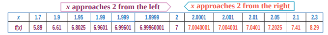
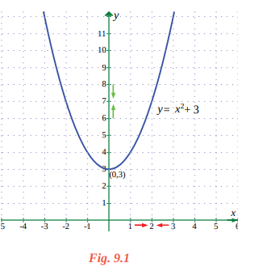
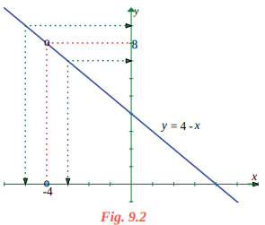
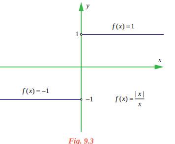
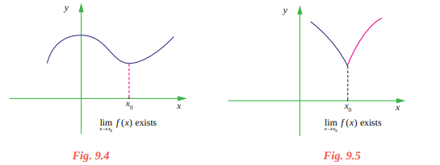
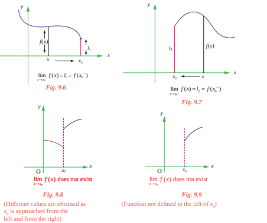



# 9.2.1 The calculation of limits

The notion of a limit, which we will discuss extensively in this chapter, plays a central role in
calculus and in much of modern mathematics. However, although mathematics dates back over three
thousand years, limits were not really understood until the monumental work of the great French
mathematician Augustin – Louis Cauchy and Karl Weierstrass in the nineteenth century, the age of
rigour in mathematics.
In this section we define limit and show how limits can be calculated.

## Illustration 9.1
We begin by looking at the function y=f(x)=x2+3. Note that f is a function from
R->R
Let us investigate the behaviour of this function near x = 2. We can use two sets of x values : one
set that approaches 2 from the left (values less than 2) and one set that approaches 2 from the right
(values greater than 2) as shown in the table.

It appears from the table that as x gets close to
x = 2, f(x)=x2+ 3 gets close to 7. This is not surprising
since if we now calculate f(x) at x = 2, we obtain
f(2)=22+ 3 = 7.

In order to guess at this limit, we didn’t have to
evaluate x2+3 at x = 2.

That is, as x approaches 2 from either the left
(values lower than 2) or right (values higher than 2)
the functional values f(x) are approaching 7 from
either side; that is, when x is near 2, f(x) is near 7.
The above situation is described in a condensed
form:

The value 7 is the left limit of f(x) as x approaches
2 from the left as well as 7 is the right limit of
f(x) as x approaches 2 from the right and write :

f(x)->7 as x->2- and f(x)->7 as x->2+

 or 

limx->2- f(x)=7 and limx->2+ f(x)=7

Note also that limx->2- f(x)=7=limx->2+ f(x)=7. The common value is written as limx->2 f(x)=7

We also observe that the limit is a definite real number. Here, definiteness means that limx->2-f(x) and limx->2+f(x) are the same and

limx->2 f(x)=limx->2-f(x) +limx->2+f(x) is a unique real number.

The figure in Fig. 9.1 explains the geometrical significance of the above discussion of the
behaviour of f(x) = x2+ 3 as x → 2.

## Illustration 9.2

Next, let us look at the rational function f(x)=\\(\frac{16-{x^{2}}}{4+x}\\) 

The domain of this function is \{-4}. Although f(- 4) is not defined, nonetheless, f(x) can be
calculated for any value of x near - 4 because the symbol limx->-4\\(\frac{16-{x^{2}}}{4+x}\\)says that we consider values
of x that are close to - 4 but not equal to - 4. The table below gives the values of f(x) for values of
x that approach - 4.

For x ≠ - 4, f(x) can be simplified by
cancellation :

f(x)=\\(\frac{16-{x^{2}}}{4+x}\\) = \\(\frac{(4+x)(4-x)} {(4+x)}\\)=4-x

As seen in Fig.9.2, the graph of f(x) is essentially

the graph of y = 4 - x with the exception that the
graph of f has a hole (puncture) at the point that
corresponds to x = - 4. As x gets closer and closer
to - 4, represented by the two arrow heads on the
x-axis, the two arrow heads on the y-axis simultaneously get closer and closer to the number 8.

Here, note that 

limx→−4-f(x) = 8 =limx→−4+f(x) and hence 4 limx→−4f(x) = lim x→-4\\(\frac{16-{x^{2}}}{4+x}\\)=8

In Illustration 9.2, note that the function is not defined at x = −4 and yet f(x) appears to be
approaching a limit as x approaches - 4. This often happens, and **it is important to realise that the
existence or non-existence of f(x) at x = −4 has no bearing on the existence of the limit of f(x)
as x approaches −4**.

 **Illustration 9.3**

Now let us consider a function different from Illustrations 9.1 and 9.2.

Let f(x) =|\\(\frac {|x|} x\\) .

x = 0 does not belong to the domain of
this function, \ {0}. Look at the graph of
this function. From the graph one can see that
for positive values of x, 

 \\(\frac {|x|} {x4}\\)=\\(\frac x x \\)=+1 and 

for negative x values, \\(\frac {|x|} {x4}\\)=\\(\frac {-x} x \\)=-1

This means that no matter how close x
gets to 0 (in a small neighbourhood of 0), there
will be both positive and negative x values that
yield f(x) = 1 and f(x) = - 1.

That is, limx→0- f(x) = - 1 and limx→0+ f(x) = + 1

This means that the limit does not exist. Of course, for any other value of x, there is a limit.

For example limx→2- \\(\frac {|x|} x\\) =1 and limx→2+ \\(\frac {|x|} x\\) =1.

Similarly, limx→-3- \\(\frac {|x|} x\\) = limx→-3- \\(\frac {-x} x \\)=-1

limx→-3+ \\(\frac {|x|} x\\) = limx→-3+\\(\frac {-x} x \\)=-1.

In fact, for any real number x0 ≠ 0, limx→x0- \\(\frac {|x|} x\\) = -1 = limx→x0+  if x0< 0 and

limx→x0- \\(\frac {|x|} x\\) = 1 = limx→x0+  if x0>0

We call the attention of the reader to observe the differences reflected in Illustrations 9.1 to 9.3. In
Illustration 9.1, the function f(x) = x2+ 3 is defined at x = 2. i.e., 2 belongs to the domain of f namely \\(\mathbb{R}\\) = (-∞, ∞). In Illustration 9.2, the function is not defined at x = - 4. In the former case we say the 

limit, limx→2 f(x) exists as x gets closer and closer to 2 to mean that limx→2-f(x) and limx→2+ f(x) stand for a

unique real number. In the later case, although it is not defined at x = - 4, limx→-4 f(x) exist as x gets

closer and closer to - 4. In Illustration 9.3, limx→0\\(\frac {|x|} x\\) does not exist to mean that the one sided limits

limx→0-\\(\frac {|x|} x\\) and limx→0+\\(\frac {|x|} x\\) are different as x gets sufficiently close to 0. In the light of these observations

we have the intuitive notion of limit as in

---
**Definition 9.1**

Let I be an open interval containing x0 \\(\epsilon \\) . Let f I: . → \\(\mathbb{R}\\) Then we say that the limit of f(x) is L, as x approaches x0 [symbollically written as 0
limx→x0f(x) L ], if, whenever x becomes
sufficiently close to x0 from either side with x≠ x0, f(x) gets sufficiently close to L. 

 ---

The following (Fig 9.4 and 9.5) graphs depict the above narrations.

# 9.2.2 One sided limits

---

**Definition 9.2**

We say that the left-hand limit of f(x) as x approaches x0(or the limit of f(x) as x approaches x0from the left) is equal to l1 if we can make the values of f(x) arbitrarily close to l1 by taking x to be sufficiently close to x0 and less than x0. It is symbolically written as f(x0-)= limx→x0- f(x)= l1

---

Similarly, we define the right hand limit.

---

**Definition 9.3**

We say that the right-hand limit of f(x) as x approaches x0 (or the limit of f(x) as x approaches x0from the right) is equal to l2 if we can make the values of f(x)arbitrarily close to l2 by taking x to be sufficiently close to x0and greater than x0. It is symbolically written as f(x0+)= limx→x0+ f(x)= l2

---

Thus the symbols “ x→x0-” and “ x → x0+” mean that we consider only x < x0 and x > x0
respectively.

These definitions are illustrated in the following Fig. 9.6 to 9.9.

