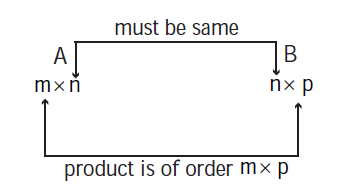

# Matrices

A *matrix* is a rectangular array or arrangement of entries or elements displayed in rows and columns put within a square bracket [ ].

In general, the entries of a matrix may be real or complex numbers or functions of one variable (such as polynomials, trigonometric functions or a combination of them) or more variables or any other object. Usually, matrices are denoted by capital letters A, B, C, ... etc. In this chapter the entries of matrices are restricted to either real numbers or real valued functions on real variables.

**General form of a matrix**

If a matrix A has m rows and n columns, then it is written as A=[a_{ij}]_{m×n},1\le i\le m\le j\le n.
That is,
A=[a_{ij}]_{m*n} = 
\begin{bmatrix}
    a_{11} & a_{12} & ...&a_{1j}& ... &a_{1n} \\
    a_{21} & a_{22} & ...&a_{2j}& ... &a_{2n} \\
    \vdots & \vdots & \ddots & \vdots & \vdots & \vdots\\
    a_{i1} & a_{i2} & ...&a_{ij}& ... &a_{in} \\
    \vdots & \vdots & \vdots & \vdots & \ddots & \vdots\\
    a_{m1} & a_{m2} & ...&a_{mj}& ... &a_{mn} \\
\end{bmatrix}

Note that *m* and *n* are positive integers.

The following are some examples of matrices :

A=\begin{bmatrix}
    2 & 0 & -1\\
    1 & 4 & 5\\
    9 & -8 & 6\\
\end{bmatrix},
B=\begin{bmatrix}
   7 & -9 & 1.2 & 0\\
   sin\frac x4 & 2  & x^2 & 4\\
   cos\frac x2 & 1 & 3 & -6\\
\end{bmatrix},and \space
C=\begin{bmatrix}
    1 & 5 & -7\\
    3.4 & \frac12 & \sqrt2\\
    e^-2 & -3 & 4\\
    \sqrt5 & 2 & a\\
\end{bmatrix}


In a matrix, the horizontal lines of elements are known as rows and the vertical lines of elements are known as columns. Thus A has 3 rows and 3 columns, B has 3 rows and 4 columns, and C has 4 rows and 3 columns.

---
**Defination 7.1**

If a matrix A has m rows and n columns then the order or size of the matrix A is defined to be \\(m × n\\) (read as *m* by *n*).

---

The objects \\(a_{11},a_{12},...,a_{mn}\\) are called elements or entries of the matrix \\(A={[a_{ij}]}{m*n}\\). This element \\(a_{ij}\\) is common to \\(i^{th}\\) row and \\(j^{th}\\) column and is called \\((i,j)^{th}\\) element of _A_. Observe that the \\(i^{th}\\) row and \\(j^{th}\\) column of _A_ are 1 × _n_ and _m_ x 1 mmatrices respectively and are given by 
\begin{bmatrix}
    a_{i1} & a_{i2} & ... & a_{in}\\
\end{bmatrix}
and 
\begin{bmatrix}
    a_{1j}\\
    a_{2j}\\ 
    \vdots\\
    a_{mj}\\
\end{bmatrix}

We shall now visualize the representation and construction of matrices for simplifying day-to-day problems.

**Illustration 7.1**

Consider the marks scored by a student in different subjects and in different terminal examinations.
They are exhibited in a tabular form as given below :
|     | Tamil  | English | Mathematics | Science | Social Science |
|----------|----------|----------|----------|----------|----------|
| Exam 1 | 48 | 71 |  80 | 62 | 55 |
| Exam 2| 70 | 68 | 91 | 73 | 60 |
| Exam 3 | 77 | 84 |  95 | 82 | 62 |

This tabulation represents the above information in the form of matrix. What does the entry in the third row and second column represent?

The above information may be represented in the form of a 3 × 5 matrix _A_ as 
A=\begin{bmatrix}
    48 & 71 & 80 & 62 & 55\\
    70 & 68 & 91 & 73 & 60\\
    77 & 84 & 95 & 82 & 62\\
\end{bmatrix}

The entry 84 common to the third row and the second column in the matrix represents the mark
scored by the student in English Exam 3.

---
**Example 7.1**

Suppose that a matrix has 12 elements. What are the possible orders it can have? What if it has 7 elements?

**Solution**

The number of elements is the product of number of rows and number of columns. Therefore, we will find all ordered pairs of natural numbers whose product is 12. Thus, all the possible orders of the matrix are 1×12, 12×1, 2×6, 6×2, 3×4 and 4×3.

Since 7 is prime, the only possible orders of the matrix are 1 × 7 and 7 × 1.

---
---
**Example 7.2**

Construct a 2 × 3 matrix whose \\((i,j)^{th}\\) element is given by a_{ij}=\frac {\sqrt3}2|2i-3j| \space (1\le i\le 2,\space 1\le j\le 3).

**Solution**

In general, a 2 x 3 matrix is given by 
A=\begin{bmatrix}
    a_{11} & a_{12} & a_{13}\\
    a_{21} & a_{22} & a_{23}\\
\end{bmatrix}


By definition of \\(a_{ij}\\), we easily have a_{11}=\frac {\sqrt3}2|2-3|=\frac {\sqrt3}2 and other entries of the matrix _A_ may be computed similarly. Thus, the required matrix _A_ is 
\begin{bmatrix}
    \frac {\sqrt3}2 & 2\sqrt3 & \frac {7\sqrt3}2\\
    \frac {\sqrt3}2 & \sqrt3 & \frac {5\sqrt3}2\\
\end{bmatrix}


---

## Types of Matrices

**Row, Column, Zero matrices**

---
**Defination 7.2**

A matrix having only one row is called a _row matrix_.

---

For instance,A=[A]_{1 × 4} = \begin{bmatrix}
    1 & 0 & -1.1 & \sqrt2\\
\end{bmatrix} is a row matrix. More generally,A=[a_{ij}]_{1 × n} = [a_{1j}]_{1 × n} is a row matrix of order 1× _n_ .

---
**Defination 7.3**

A matrix having only one column is called a _column matrix_.

---

For instance,[A]_{4 × 1} = \begin{bmatrix}
    x+1\\
    x^2\\
    3x\\
    4\\
\end{bmatrix} is a column matrix whose entries are real valued functions of real variable x. More generallyA=[a_{ij}]_{m × 1} = [a_{i1}]_{m × 1} is a column matrix of order _m_ ×1.

---
**Defination 7.4**

A matrix A=[a_{ij}]_{m × n}is said to be a _zero matrix_ or _null matrix_ or _void matrix_ denoted by _O_ if \\(a_{ij}\\) = 0 for all values of 1\le i\le m \space and\space 1\le j\le n.

---

For instance,[0], \space\begin{bmatrix}
    0 & 0 & 0\\
    0 & 0 & 0\\
    0 & 0 & 0\\\end{bmatrix} \space and \space\begin{bmatrix}
    0 & 0 & 0 & 0\\
    0 & 0 & 0 & 0\\\end{bmatrix} are zero matrices of order 1×1, 3×3 and 2×4 respectively.

A matrix _A_ is said to be a _non-zero matrix_ if at least one of the entries of A is non-zero. 

**Square, Diagonal, Unit, Triangular matrices**

---

**Definition 7.5**

A matrix in which number of rows is equal to the number of columns, is called a _square matrix_. That is, a matrix of order _n × n_ is often referred to as a square matrix of order n.

---

For instance, A=\begin{bmatrix}
    a & b & c\\
    d & e & f\\
    g & h & i\\\end{bmatrix} is a square matrix of order 3.

---

**Definition 7.6**

In a square matrix A=[a_{ij}]_{n × n} of order _n_, the elements a_{11},a_{22},a_{33},...,a_{nn} are called the _principal diagonal_ or simply the _diagonal_ or _main diagonal_ or _leading diagonal elements_.

---

---

**Definition 7.7**

A square matrix A=[a_{ij}]_{n × n} is called a _diagonal matrix_ if \\(a_{ij}\\) = 0 whenever \\(i \ne j\\).

---

Thus, in a diagonal matrix all the entries except the entries along the main diagonal are zero. For instance,
A=\begin{bmatrix}
    2.5 & 0 & 0\\
    0 & \sqrt3 & 0\\
    0 & 0 & 0.5\\\end{bmatrix},
    B=\begin{bmatrix}
    r & 0\\
    0 & s\\\end{bmatrix}
    C=[6], \space and \space
    D=\begin{bmatrix}
    a_{11} & 0 & 0 & ... & 0 \\
    0 & a_{22} & 0 & ... & 0 \\
    0 & 0 & a_{33} & ... & 0 \\
    \vdots & \vdots & \vdots & \ddots & \vdots\\
    0 & ... & ... & ... & 0 \\
\end{bmatrix}
 are diagonal matrices of order 3, 2, 1, and n respectively.

Is a square zero matrix, a diagonal matrix?

---

**Definition 7.8**

A diagonal matrix whose entries along the principal diagonal are equal is called a _Scalar matrix_.

---

That is, a square matrixA=[a_{ij}]_{n × n}is said to be a scalar matrix if 
(a_{ij})=
\begin{cases}
   c &\text{when } i = j \\
   0 &\text{when } i ≠ j \\
\end{cases}where c is a fixed number. For instance,
A=\begin{bmatrix}
    \sqrt2 & 0 & 0\\
    0 & \sqrt2 & 0\\
    0 & 0 & \sqrt2\\\end{bmatrix},
    B=\begin{bmatrix}
    -5 & 0\\
    0 & -5\\\end{bmatrix}
    C=[\sqrt3], \space and \space
    D=\begin{bmatrix}
    c & 0 & ... & 0 \\
    0 & c & ... & 0 \\
    \vdots & \vdots & \ddots & \vdots\\
    0 & 0 & ... & c \\
\end{bmatrix}
are scalar matrices of order 3, 2, 1, and _n_ respectively.

Observe that any square zero matrix can be considered as a scalar matrix with scalar 0.

---

**Definition 7.9**

A square matrix in which all the diagonal entries are 1 and the rest are all zero is called a _unit matrix_. Thus, a square matrix A=[a_{ij}]_{n × n}is said to be a unit matrix if 
(a_{ij})=
\begin{cases}
   1 &\text{when } i = j \\
   0 &\text{when } i ≠ j \\
\end{cases}.

---

We represent the unit matrix of order _n_ as . \\(I_n\\) For instance,
I_1=[1], \space
    I_2=\begin{bmatrix}
    1 & 0\\
    0 & 1\\\end{bmatrix}, \space
    I_3=\begin{bmatrix}
    1 & 0 & 0\\
    0 & 1 & 0\\
    0 & 0 & 1\\\end{bmatrix}, \space and \space
    I_n=\begin{bmatrix}
    1 & 0 & ... & 0 \\
    0 & 1 & ... & 0 \\
    \vdots & \vdots & \ddots & \vdots\\
    0 & 0 & ... & 1 \\
\end{bmatrix}
are unit matrices of order 1, 2, 3 and _n_ respectively.

**Note 7.1**

Unit matrix is an example of a scalar matrix.

There are two kinds of triangular matrices namely upper triangular and lower triangular matrices.

---

**Definition 7.10**

A square matrix is said to be an _upper triangular matrix_ if all the elements below the main diagonal are zero.

---

Thus, the square matrix A=[a_{ij}]_{n × n} is said to be an upper triangular matrix if \\(a_{ij} = 0\\) for all \\(i>j\\). For instance,

    \begin{bmatrix}
    4 & 3 & 0\\
    0 & 7 & 8\\
    0 & 0 & 2\\\end{bmatrix}, \space
    \begin{bmatrix}
    -5 & 2\\
    0 & 1\\\end{bmatrix}, \space and \space
    \begin{bmatrix}
    a_{11} & a_{12} & ... & a_{1n}\\
    0 & a_{22} & ... & a_{2n} \\
    \vdots & \vdots & \ddots & \vdots\\
    0 & 0 & 0 & a_{nn} \\
\end{bmatrix}
are all upper triangular matrices.

---

**Definition 7.11**

A square matrix is said to be a _lower triangular matrix_ if all the elements above the main diagonal are zero.

---

More precisely, a square matrix A=[a_{ij}]_{n × n} is said to be a lower triangular matrix if 0 for all \\(a_{ij} = 0\\) for all \\(i< j\\) For instance,

    \begin{bmatrix}
    2 & 0 & 0\\
    4 & 1 & 0\\
    0 & 0 & 0\\\end{bmatrix}, \space
    \begin{bmatrix}
    2 & 0 & 0\\
    4 & 1 & 0\\
    8 & -5 & 7\\\end{bmatrix}, \space
    \begin{bmatrix}
    -2 & 0\\
    9 & -3\\\end{bmatrix}, \space and \space
    \begin{bmatrix}
    a_{11} & 0 & ... & 0\\
    a_{21} & a_{22} & 0 & 0\\
    \vdots & \vdots & \ddots & \vdots\\
    a_{n1} & a_{n2} & ... & a_{nn} \\
\end{bmatrix}
are all lower triangular matrices.

---

**Definition 7.12**

A square matrix which is either upper triangular or lower triangular is called a _triangular matrix_.

---

Observe that a square matrix that is both upper and lower triangular simultaneously will turn out to be a diagonal matrix.

## Equality of Matrices

---

**Definition 7.13**

Two matrices A=[a_{ij}] \space \text{and} \space B=[b_{ij}] are equal (written as _A_ = _B_) if and only if

(i) both _A_ and _B_ are of the same order

(ii) the corresponding entries of _A_ and _B_ are equal. That is, a_{ij}=b_{ij}for all _i_ and _j_.

---

For instance, if 
    \begin{bmatrix}
    x & y\\
    u & v\\\end{bmatrix} =
    \begin{bmatrix}
    2.5 & -1\\
    \frac1{\sqrt2} & \frac35\\\end{bmatrix}, then we must have \\(x=2.5, y=-1, u=\frac1{\sqrt2} \space and \space v=\frac35\\).

---

**Definition 7.14**

Two matrices A and B are called _unequal_ if either of condition (i) or (ii) of Definition 7.13 does not hold.

---

For instance,
    \begin{bmatrix}
    4 & -3\\
    0 & 8\\\end{bmatrix} ≠
    \begin{bmatrix}
    8 & -5\\
    0 & 4\\\end{bmatrix}as the corresponding entries are not equal. Also 
    \begin{bmatrix}
    4 & -3\\
    0 & 8\\\end{bmatrix} ≠
    \begin{bmatrix}
    5 & -8\\
    3 & 4\\
    6 & 7\\\end{bmatrix} as the orders are not the same.

---

**Example 7.3**

Find _x_, _y_, _a_ and _b_ if 
    \begin{bmatrix}
    3x+4y & 6 & x-2y\\
    a+b & 2a-b & -3\\\end{bmatrix} =
    \begin{bmatrix}
    2 & 6 & 4\\
    5 & -5 & -3\\\end{bmatrix}

**Solution**

As the orders of the two matrices are same, they are equal if and only if the corresponding entries are equal. Thus, by comparing the corresponding elements, we get 3x+4y=2, \space x-2y=4, \space a+b=5, \space \text{and} \space 2a-b=-5.

Solving these equations, we get x=2, \space y=-1, \space a=0, \space \text{and} \space b=5.

---

## Algebraic Operations on Matrices

Basic operations on matrices are

(1) multiplication of a matrix by a scalar,

(2) addition/subtraction of two matrices, and

(3) multiplication of two matrices.

There is no concept of dividing a matrix by another matrix and thus, the operation \\(\frac AB\\) , where _A_ and _B_ are matrices, is not defined.

**(1) Multiplication of a matrix by a scalar**

For a given matrix A=[a_{ij}]_{m × n} and a scalar _k_, we define a new matrix kA=[b_{ij}]_{m × n} where b_{ij}=ka_{ij} for all _i_ and _j_.

For instance, if 
    A=\begin{bmatrix}
    a & b & c\\
    d & e & f\\\end{bmatrix}, then 
    kA=\begin{bmatrix}
    ka & kb & kc\\
    kd & ke & kf\\\end{bmatrix}

In particular if _k_ = −1, we obtain -A=[-a_{ij}]_{m × n}. This _-A_ is called _negative_ of the matrix _A_. Don’t say _-A_ as a negative matrix.

**(2) Addition and Subtraction of two matrices**

If _A_ and _B_ are two matrices of the same order, then their sum denoted by _A + B_, is again a matrix of same order, obtained by adding the corresponding entries of _A_ and _B_.

More precisely, ifA=[a_{ij}]_{m × n}andB=[b_{ij}]_{m × n}  are two matrices, then the sum _A + B_ of _A_ and _B_ is a matrix given byA+B=[c_{ij}]_{m × n} where c_{ij}=a_{ij} + b_{ij}for all _i_ and _j_.

Similarly subtraction _A - B_ is defined as _A − B = A + (−1)B_.

That is,A-B=[d_{ij}]_{m × n}whered_{ij}=a_{ij} - b_{ij} \space \forall _i_ and _j_.. (The symbol \\(\forall\\) denotes for every or for all).

**Note 7.2**

(i) If _A_ and _B_ are not of the same order, then _A + B_ and _A - B_ are not defined.

(ii) The addition and subtraction can be extended to any finite number of matrices.

---

**Example 7.4**

Compute _A + B_ and _A - B_ if 
    A=\begin{bmatrix}
    4 & \sqrt5 & 7\\
    -1 & 0 & 0.5\\\end{bmatrix} \space and \space
    B=\begin{bmatrix}
    \sqrt3 & \sqrt5 & 7.3\\
    1 & \frac13 & \frac14\\\end{bmatrix}

**Solution**

By the definitions of addition and subtraction of matrices, we have 
    A+B=\begin{bmatrix}
    4+\sqrt3 & 2\sqrt5 & 14.3\\
    0 & \frac13 & \frac34\\\end{bmatrix} \space and \space
    A-B=\begin{bmatrix}
    4-\sqrt3 & 0 & -0.3\\
    -2 & -\frac13 & \frac14\\\end{bmatrix}

---

---

**Example 7.5**

Find the sum _A + B + C_ if _A, B, C_ are given by
    A=\begin{bmatrix}
    sin^2θ & 1\\
    cot^2θ & 0\\\end{bmatrix}, \space
    B=\begin{bmatrix}
    cos^2θ & 0\\
    -cosec^2θ & 1\\\end{bmatrix}\space and \space
    C=\begin{bmatrix}
    0 & -1\\
    -1 & 0\\\end{bmatrix}
    

**Solution**

By the definitions of sum of matrices, we have 
    A+B+C=\begin{bmatrix}
    sin^2θ+cos^2θ+0 & 1+0+1\\
    cot^2θ-cosec^θ-1 & 0+1+0\\\end{bmatrix}=
    \begin{bmatrix}
    1 & 0\\
    -2 & 1\\\end{bmatrix}
    
---

**Example 7.6**

Determine _3B + 4C - D_ if _B_, _C_, and _D_ are given by
    B=\begin{bmatrix}
    2 & 3 & 0\\
    1 & -1 & 5\\\end{bmatrix}, \space
    C=\begin{bmatrix}
    -1 & -2 & 3\\
    -1 & 0 & 2\\\end{bmatrix},\space
    D=\begin{bmatrix}
    0 & 4 & -1\\
    5 & 6 & -5\\\end{bmatrix}
    

**Solution**


    3B+4C-D=\begin{bmatrix}
    6 & 9 & 0\\
    3 & -3 & 15\\\end{bmatrix}+
    \begin{bmatrix}
    -4 & -8 & 12\\
    -4 & 0 & 8\\\end{bmatrix}+
    \begin{bmatrix}
    0 & -4 & 1\\
    -5 & -6 & 5\\\end{bmatrix}=
    \begin{bmatrix}
    2 & -3 & 13\\
    -6 & -9 & 28\\\end{bmatrix}
    
    
---

---

**Example 7.7**

Simplyfy : 
    secθ\begin{bmatrix}
    secθ & tanθ\\
    tanθ & secθ\\\end{bmatrix}-
    tanθ\begin{bmatrix}
    tanθ & secθ\\
    secθ & tanθ\\\end{bmatrix}
    

**Solution**

If we denote the given expression by _A_, then using the scalar multiplication rule, we get


    A=\begin{bmatrix}
    sec^2θ & secθtanθ\\
    secθtanθ & sec^2θ\\\end{bmatrix}-
    \begin{bmatrix}
    tan^2θ & tanθsecθ\\
    secθtanθ & tan^2θ\\\end{bmatrix}=
    \begin{bmatrix}
    1 & 0\\
    0 & 1\\\end{bmatrix}
    
    
---

**(3) Multiplication of matrices**

---

**Definition 7.15**

A matrix _A_ is said to be _conformable for multiplication_ with a matrix _B_ if the number of columns of _A_ is equal to the number of rows of _B_.

---

That is, if A=[a_{ij}]_{m × n}andB=[b_{ij}]_{m × n} are given two matrices, then the product of matrices _A_ and _B_ is denoted by _AB_ and its order is _m × p_.

The order of _AB_ is _m × p_ = (number of rows of _A_)×(number of columns of _B_).

If A=\begin{bmatrix}
    a_1 & a_2 & ... & a_n\\\end{bmatrix}_{1×n} and 
    B=\begin{bmatrix}
    b_1\\
    b_2\\
    \vdots\\
    b_n\end{bmatrix}_{n×1}, then _AB_ is a matrix of order 1 × 1, that gives a single element which is defined by AB=\begin{bmatrix}
    a_1 & a_2 & ... & a_n\\\end{bmatrix}\begin{bmatrix}
    b_1\\
    b_2\\
    \vdots\\
    b_n\end{bmatrix}=[a_1b_1+a_2b_2+...+a_nb_n]=[\sum_{k=1}^n a_kb_k]

For instance,
    \begin{bmatrix}
    1 & 2 & 3\\\end{bmatrix}
    \begin{bmatrix}
    -2\\
    3\\
    5\\\end{bmatrix}=[1(-2)+2(3)+3(5)]=[-2+6+15]=[19]

In general,

if A = \\([a_{ij}]_{m×n}\\) = \begin{bmatrix}
    a_{11} & a_{12} & ... & a_{1n}\\
    a_{21} & a_{22} & ... & a_{2n}\\
    \vdots & \vdots & \ddots & \vdots\\
    a_{m1} & a_{m2} & ... & a_{mn}\\\end{bmatrix} and B = [b_{ij}]_{n×p} = \begin{bmatrix}
    b_{11} & b_{12} & ... & b_{1p}\\
    b_{21} & b_{22} & ... & b_{2p}\\
    \vdots & \vdots & \ddots & \vdots\\
    b_{n1} & b_{n2} & ... & b_{np}\\\end{bmatrix} then
\overrightarrow{\begin{bmatrix}
    a_{11} & a_{12} & ... & a_{1n}\\
    a_{21} & a_{22} & ... & a_{2n}\\
    \vdots & \vdots & \ddots & \vdots\\
    a_{m1} & a_{m2} & ... & a_{mn}\\\end{bmatrix}}
    \darr{\begin{bmatrix}
    b_{11} & b_{12} & ... & b_{1p}\\
    b_{21} & b_{22} & ... & b_{2p}\\
    \vdots & \vdots & \ddots & \vdots\\
    b_{n1} & b_{n2} & ... & b_{np}\\\end{bmatrix}} and the product AB=[c_{ij}]_{m×p}={\begin{bmatrix}
    c_{11} & c_{12} & ... & c_{1p}\\
    c_{21} & c_{22} & ... & c_{2p}\\
    \vdots & \vdots & \ddots & \vdots\\
    c_{m1} & c_{m2} & ... & c_{mp}\\\end{bmatrix}}
    
where c_{ij}=\begin{bmatrix}
    a_{i1} & a_{i2} & ... & a_{in}\\\end{bmatrix}\begin{bmatrix}
    b_{1j}\\
    b_{2j}\\
    \vdots\\
    b_{nj}\end{bmatrix}=\sum_{k=1}^n a_{ik}b_{kj} since \\(c_{ij}\\) is an element.