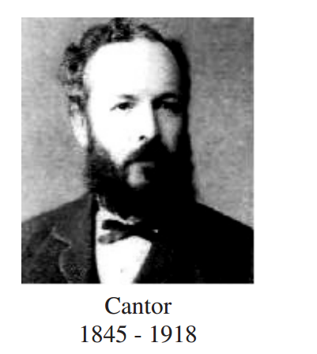

# Sets, Relations and Functions

## Introcution
The concepts of sets, relations and functions occupy a fundamental place in the mainstream of
mathematical thinking. As rightly stated by the Russian mathematician Luzin the concept of functions
did not arise suddenly. It underwent profound changes in time. Galileo (1564-1642) explicitly used
the dependency of one quantity on another in the study of planetary motions. Descartes (1596-
1650) clearly stated that an equation in two variables, geometrically represented by a curve, indicates
dependence between variable quantities. Leibnitz (1646-1716) used the word “function”, in a 1673
manuscript, to mean any quantity varying from point to point of a curve. Dirichlet (1805-1859),
a student of Gauss, was credited with the modern “formal” definition of function with notation
y = f(x). In the 20th century, this concept was extended to include all arbitrary correspondence
satisfying the uniqueness condition between sets and numerical or non-numerical values.
With the development of set theory, initiated by Cantor (1845-1918), 
the notion of function continued to evolve. From the notion of correspon￾dence,

mathematicians moved to the notion of relation. However even
now in the theory of computation, a function is not viewed as a relation
but as a computational rule. The modern definition of a function is given
in terms of relation so as to suit to develop artificial intelligence.
In the previous classes, we have studied and are well versed with the
real numbers and arithmetic operations on them. We also learnt about
sets of real numbers, Venn diagrams, Cartesian product of sets, basic
definitions of relations and functions. For better understanding, we recall
more about sets and Cartesian products of sets. In this chapter, we see a
new facelift to the mathematical notions of “Relations” and “Functions”

**Learning Objectives :-**
On completion of this chapter, the students are expected to
• list and work with many properties of sets and Cartesian product;
• know the concepts of constants, variables, intervals and neighbourhoods;
• understand about various types of relations; create relations of any required type;
• represent functions in different ways;
• work with elementary functions, types of functions, operations on functions including inverse
of a bijective function;
• identify the graphs of some special functions;
• visualize and sketch the graphs of some relatively complicated functions.

