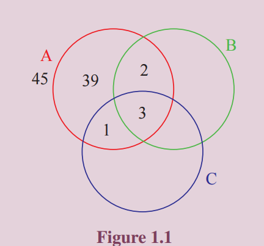

# Cartesian Product
We know that the Cartesian product of sets is nothing but a set of ordered elements. In particular,
Cartesian product of two sets is a set of ordered pairs, while the Cartesian product of three sets is a
set of ordered triplets. Precisely, let A, B and C be three sets. Then the Cartesian product of A with
B is denoted by A × B. It is defined by
>A × B = {(a, b) : a ∈ A, b ∈ B}.

Similarly, the Cartesian product A × B × C is defined by
>A × B × C = {(a, b, c) : a ∈ A, b ∈ B, c ∈ C}.

Thus A × A = {(a, b) : a, b ∈ A}.
>Is it correct to say A × A = {(a, a) : a ∈ A}?

It is important that the elements of the Cartesian product are ordered and hence, for non-empty sets,
>A × B  \neq B × A, unless A = B.

That is, for non-empty sets A × B = B × A if and only if A = B. We know that R denotes the set of
real numbers and
>R × R = {(x, y) : x, y ∈ R}.

>R × R × R = {(x, y, z) : x, y, z ∈ R}.

Symbolically, R × R can be represented as R
2
and R × R × R as R
3
. Note that R × R is a set of
ordered pairs and R × R × R is a set of ordered triplets.
If A = {1, 2, 3} and B = {2, 4, 6} then
>A × B = {(1, 2),(1, 4),(1, 6),(2, 2),(2, 4),(2, 6),(3, 2),(3, 4),(3, 6)}.

Here A × B is a subset of R × R. The number of elements in A × B is the product of the number
of elements in A and the number of elements in B, that is, n(A × B) = n(A)n(B), if A and B are
finite. Further n(A × B × C) = n(A)n(B)n(C), if A, B and C are finite.
It is easy to see that the following are the subsets of R × R.

<pre>
<b>Example 1.1</b> Find the number of subsets of A if A = {x : x = 4n + 1, 2 ≤ n ≤ 5, n ∈ N}.
<b>Solution:</b>
Clearly A = {x : x = 4n + 1, n = 2, 3, 4, 5} = {9, 13, 17, 21}.
Hence n(A) = 4. This implies that n(P(A)) = 24 = 16.
</pre>
<pre>
<b>Example 1.2</b> In a survey of 5000 persons in a town, it was found that 45% of the persons know
Language A, 25% know Language B, 10% know Language C, 5% know Languages A and B, 4%
know Languages B and C, and 4% know Languages A and C. If 3% of the persons know all the
three Languages, find the number of persons who knows only Language A.
<b>Solution:</b>
This problem can be solved either by property of cardinality or by Venn diagram.
Cardinality: Given that n(A) = 45% of 5000 = 2250
Similarly, n(B) = 1250, n(C) = 500, n(A ∩ B) = 250, n(B ∩ C) = 200, n(C ∩ A) = 200 and
n(A ∩ B ∩ C) = 150.
The number of persons who knows only Language A is
n(A ∩ B' ∩ C') = n{A ∩ (B ∪ C)'} = n(A) − n{A ∩ (B ∪ C)}.
               = n(A) − n(A ∩ B) − n(A ∩ C) + n(A ∩ B ∩ C).
               = 2250 − 250 − 200 + 150 = 1950.
Thus the required number of persons is 1950.
Venn diagram: We draw the Venn Diagram using percentage.

From Figure 1.1, the percentage of persons who knows only Language A is 39. Therefore, the
required number of persons is 5000 ×39/100 =1950
</pre>

<pre>
<b>Example 1.3</b> Prove that ((A ∪ B' ∪ C) ∩ (A ∩ B' ∩ C')) ∪ ((A ∪ B ∪ C') ∩ (B' ∩ C')) = B' ∩ C'.
<b>Solution:</b>
We have A ∩ B' ∩ C' ⊆ A ⊆ A ∪ B0 ∪ C and hence (A ∪ B' ∪ C) ∩ (A ∩ B' ∩ C') = A ∩ B' ∩ C'.
Also, B'∩ C' ⊆ C' ⊆ A ∪ B ∪ C' and hence (A ∪ B ∪ C') ∩ (B' ∩ C') = B' ∩ C'.
Now as A ∩ B'∩ C' ⊆ B' ∩ C', we have
        ((A ∪ B' ∪ C) ∩ (A ∩ B' ∩ C')) ∪ ((A ∪ B ∪ C') ∩ (B' ∩ C')) = B' ∩ C'.
</pre>

<pre>

</pre>