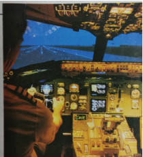
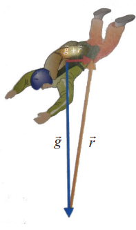
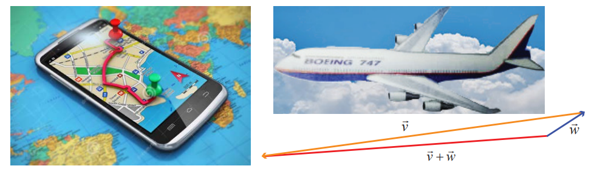
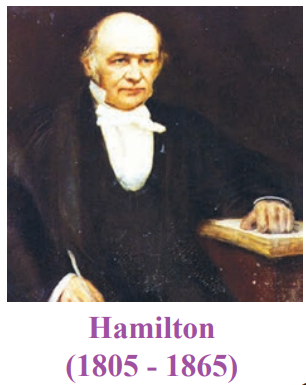
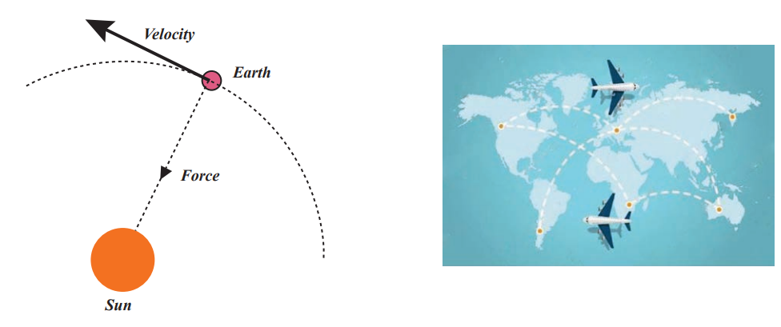

## Introduction 

&nbsp;&nbsp;&nbsp;&nbsp;&nbsp;&nbsp;A pilot constructing a flight plan has to be concerned about the plane’scourse, heading, air speed, and ground speed. In order for the plane to proceed directly toward its destination, it must head into the wind at an angle such that the wind is exactly counteracted. If available, a navigation computer will do the calculation quickly and accurately. If, however, a navigation computer is not accessible, the pilot may have to depend on encil-and-paper work supplemented by a calculator with a knowledge of vectors. An understanding of vectors and their operations is therefore vitally important.

&nbsp;&nbsp;&nbsp;&nbsp;&nbsp;&nbsp;At a certain point during a jump, there are two principal forces acting on a skydiver. One force \overrightarrow{g}gravity exerting straight down and another air resistance\overrightarrow{r}exerting up as well as to some direction. hat is the net force acting on the skydiver? The answer is \overrightarrow{g}+ \overrightarrow{r}. (how?)

&nbsp;&nbsp;&nbsp;&nbsp;&nbsp;&nbsp;Let \overrightarrow{v} be the velocity vector of an aircraft. Suppose that the wind velocity is given by the vector \overrightarrow{w} , what is the effective velocity of aircraft? The answer is \overrightarrow{v}+ \overrightarrow{w}.In what direction should the aircraft head in order to fly due west?

A global positioning system (GPS) is a system designed to help to navigate on the earth, in the air
and on water. Vectors are also used in GPS.

&nbsp;&nbsp;&nbsp;&nbsp;&nbsp;&nbsp;The development of the concept of vectors was influenced by the works of the German mathematician H.G. Grassmann (1809 - 1877) and the Irish mathematician W.R. Hamilton (1805 - 1865). While Hamilton occupied high positions, Grassman was a secondary school teacher.

&nbsp;&nbsp;&nbsp;&nbsp;&nbsp;&nbsp;The best features of Quaternion Calculus and Cartesian Geometry were united, largely through the efforts of the American Mathematician J.B. Gibbs (1839 - 1903) and Q.Heaviside (1850 - 1925) of England and new subject called Vector Algebra was created. The development of the algebra of vectors and of vector analysis as we know it today was first revealed in sets of remarkable notes made by Gibbs for his students at Yale University. Clifford (1845 – 1879), in his Elements of Dynamics (1878),
broke down the product of two quaternions into two very different vector products, which he called the scalar product and the vector product. The term vectors was due to Hamilton and it was derived from the Latin word ‘to carry’. 
&nbsp;&nbsp;&nbsp;&nbsp;&nbsp;&nbsp;The theory of vector was also based on Grassman’s theory of extension.

&nbsp;&nbsp;&nbsp;&nbsp;&nbsp;&nbsp;It was soon realised that vectors would be the ideal tools for the fruitful study of many ideas in geometry and physics. Vectors are now the modern language of a great deal of physics and applied mathematics and they continue to hold their own intrinsic mathematical interest.

>Learning Objective
On completion of this chapter, the students are expected to
• realise vectors as a tool to study the various geometric and physics problems.
• distinguish the scalars from vectors.
• understand different types of vectors and algebra of vectors.
• understand the geometrical interpretations and resolutions of 2D and 3D vectors.
• appreciate the usage of matrix theory in vector algebra.
• visualise scalar product and vector product yielding scalars and vectors respectively as a 
unique feature