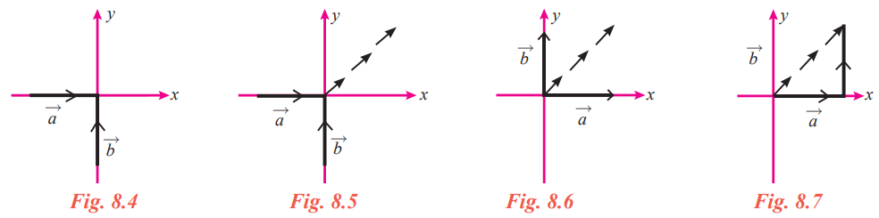
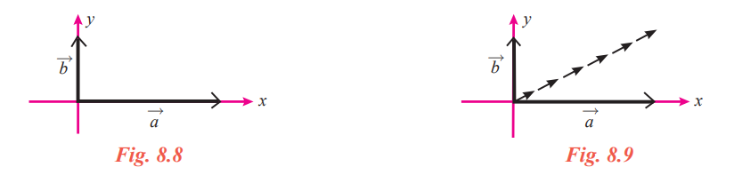
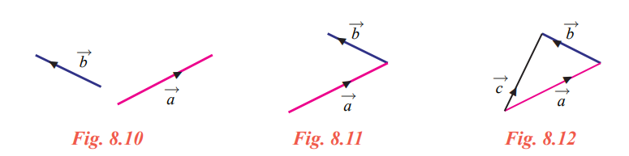
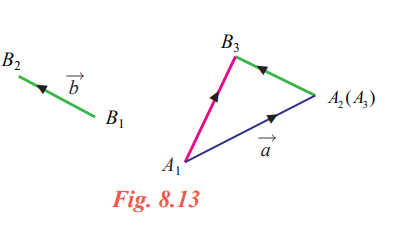

## Algebra Of Vectors

&nbsp;&nbsp;&nbsp;&nbsp;&nbsp;&nbsp;We have studied basic algebraic operations on real numbers and on matrices. Similarly we studied some operations on vectors. Now let us see how to add two vectors, subtract a vector from another vector and multiply a vector by a scalar. 

### Addition Of Vectors
&nbsp;&nbsp;&nbsp;&nbsp;&nbsp;&nbsp;Let us define the sum of two vectors in two ways and see that they are the same. Let us assume that an object of unit mass is placed at the origin (0,0) in \R ^2
 . We assume that the size of the object is just a point. Let us assume that two forces \overrightarrow{a} and \overrightarrow{b} of unit magnitude act on the object in the positive
directions of x-axis and y-axis respectively (Fig.8.4). It is easy to guess that the object will move in
the direction 45° to the x-axis as indicated in Fig.8.5. The forces \overrightarrow{a} and \overrightarrow{b}  are equal to the vectors\overrightarrow{a} and \overrightarrow{b}  as indicated in Fig. 8.6. We may think that the forces push the object in Fig. 8.4 and pull the object in Fig.8.6. 

The next question before us is ‘How long will it go?’. Let us assume that the forces act one after
the other. The force \overrightarrow{a} will move the object one unit along the x-axis. So the object will move from (0, 0) to (1, 0). Now the force \overrightarrow{b}  will move the object vertically from (1, 0) to (1, 1). So finally the object will be at (1, 1) (Fig. 8.7). Thus the sum of the two vectors may be defined as the line segment joining (0, 0) and (1, 1) in the direction ‘(0, 0) to (1, 1)’.

&nbsp;&nbsp;&nbsp;&nbsp;&nbsp;&nbsp;Now, as in the same situation discussed above, let us assume that the force \overrightarrow{a} has magnitude 2 instead of 1 (Fig. 8.8). It will not be difficult to guess that the object will move in a direction much closure to the x-axis as indicated in Fig. 8.9. Also we may guess that the object will go to the point (2,1). Thus the sum of the two vectors may be defined as the line segment joining (0,0) and (2,1) in the direction “(0,0) to (2,1)”.

&nbsp;&nbsp;&nbsp;&nbsp;&nbsp;&nbsp;In the two situations discussed above the directions of the forces are perpendicular to each other. This need not be the case in general. Even then we can add the forces by considering one after the other. For example let a  and b  be two forces in a plane as shown in Fig. 8.10

&nbsp;&nbsp;&nbsp;&nbsp;&nbsp;&nbsp;Bringing the initial point of b  to the terminal point of\overrightarrow{a}  (Fig. 8.11), we can get the resultant of these two forces (see Fig. 8.12). This motivates us to define the sum of two vectors. 

 # Triangle law of addition

&nbsp;&nbsp;&nbsp;&nbsp;&nbsp;&nbsp;Let \overrightarrow{a} and\overrightarrow{b}  be two vectors. Let 1 1 A B and be the initial points of \overrightarrow{a}  and \overrightarrow{b}  , and 2 2 A B and be the terminal points of \overrightarrow{a}  and \overrightarrow{b} respectively.

&nbsp;&nbsp;&nbsp;&nbsp;&nbsp;&nbsp;Draw A B3 3 parallel to B B1 2 so that 33 12 AB BB = . Then the vector \overrightarrow{A_1B_3} is defined as the sum of the vectors \overrightarrow{a} and \overrightarrow{b}, and it is denoted as \overrightarrow{a} +\overrightarrow{b}. This can be restated as,

Definition 8.10(Triangle law of addition) 
If two vectors are represented in magnitude and direction by the two sides of a triangle taken in
order, then their sum is represented by the third side taken in the reverse order.

